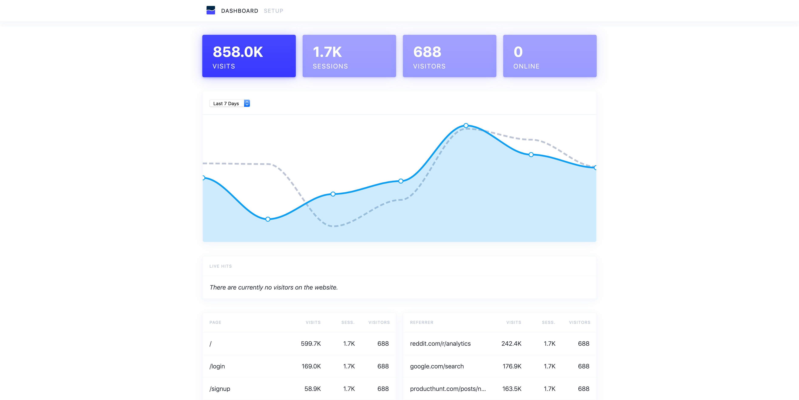

# nemea

Take control of your website analytics!

## Usage

See the `example` directory for an example of how you might run nemea
using `docker` and `docker-compose`.

## Developing

### Requirements

nemea is a [Racket] application so you'll need to install that and
you'll need [Node.js] version `10.6.0` to build the static assets.

You'll also need a running [PostgreSQL] instance.

### First-time setup

Install all the prerequisites:

    $ raco pkg install chief
    $ raco pkg install nemea/
    $ npm install
    $ cp .env.default .env

Set up the databases:

    $ psql -dpostgres <<-SQL
    create user nemea with password 'nemea' login;
    create database nemea;
    grant all privileges on database nemea to nemea;
    create database nemea_tests;
    grant all privileges on database nemea_tests to nemea;
    SQL
    $ echo "create extension if not exists hll;" | psql -dnemea
    $ echo "create extension if not exists hll;" | psql -dnemea_tests

Download Maxmind's geolocation database:

    $ curl -ls https://geolite.maxmind.com/download/geoip/database/GeoLite2-Country.tar.gz | tar -xz '*.mmdb' \
        && mv GeoLite2-Country_*/GeoLite2-Country.mmdb assets/data/GeoLite2-Country.mmdb \
        && rm -r GeoLite2-Country_*

*NB: As of Jan. 2020, you need to create an account to get access to MaxMind's GeoLite databases.*

### Running the development server

    $ raco chief start

### Running the tests

    $ raco test nemea/

## License

    nemea is licensed under the GPL. Please see COPYING for details.

[Racket]: https://racket-lang.org
[Node.js]: https://nodejs.org
[PostgreSQL]: https://www.postgresql.org
